# Automotive Performance Sales Analysis | SQL & Power BI

## Project Overview
<i>Management</i> menghadapi keterbatasan visibilitas terhadap data transaksi, sehingga masih sulit untuk memantau pola penjualan, mengevaluasi performa produk dan cabang, serta memahami preferensi metode pembayaran dan status transaksi secara menyeluruh. Project ini dilakukan untuk membantu perusahaan otomotif memahami performa penjualan kendaraan selama tahun 2025.
</p>

Analisis dilakukan berdasarkan data transaksi penjualan kendaraan tahun 2025. <i>Key questions</i> yang dieksplorasi meliputi performa penjualan, produk, cabang, metode pembayaran, status transaksi.
</p>

Power BI digunakan untuk melakukan analisis dan visualisasi data, dengan memanfaatkan DAX (Data Analysis Expressions) untuk membuat <i>calculated columns dan measures</i>. Hasil analisis digunakan untuk mengidentifikasi pola dan performa utama dalam penjualan serta menghasilkan <i>insights</i> yang dapat mendukung proses monitoring dan pengambilan <i>business reccomendations</i>.
</p>

## Dataset

Dataset yang digunakan pada <i>project</i> ini merupakan data <i>dummy</i> yang terdiri dari 10.000 baris dan 16 kolom.
</p>

| <i>Key Features</i> | Kolom |
| --- | --- |
| Transaction details | sales_date, order_id, payment_type,  status |
| Customer information | customer |
| Vechile preferences | product_name, category, color |
| Branch performance | branch, branch_adress |
| Sales performance | price, quantity, discount, trade_in, total, total_sales |

Detail dari dataset bisa dilihat [di sini](https://github.com/yyunitasa-stack/Automotive-Sales-Analysis/blob/main/Dataset/showroom_mobil_10cabang.csv).

## Project Workflow

<i>Project</i> dikerjakan melalui beberapa tahapan berikut.
</p>
<p align="center">
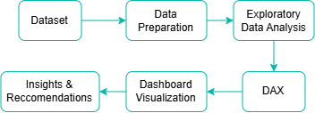
</p>

Kualitas dataset dapat diperiksa dengan cepat menggunakan fitur Column quality yang tersedia di Power BI. Hasil pemeriksaan menunjukkan bahwa setiap kolom memiliki nilai yang valid dan tidak ditemukan missing value. Namun, tipe data pada kolom sales_date perlu diubah menjadi tipe data Date agar dapat digunakan dengan tepat dalam analisis berdasarkan waktu. </p>

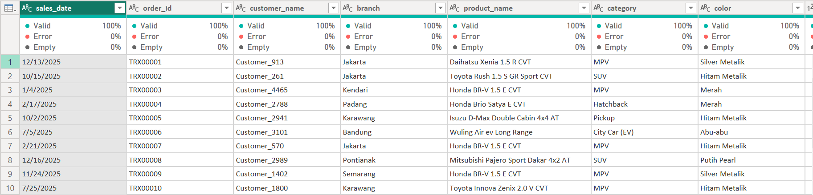

Sebelum menyusun dashboard interaktif, perlu membuat new table yaitu Date Table untuk memisahkan informasi waktu seperti tanggal, bulan, kuartal, dan tahun.</p>

```
Date Table = 
ADDCOLUMNS(
    CALENDAR(
        MIN(Sheet1[sales_date]),
        MAX(Sheet1[sales_date])),
    "Year", YEAR([Date]),
    "Month", FORMAT([Date], "MMMM"),
    "Quarter", "Q" & FORMAT([Date], "Q"))
```


Selanjutnya, tabel Date Table dihubungkan dengan tabel utama seperti yang ditunjukkan pada <i>relationship</i> diagram berikut. </p>
<p align="center">

</p>


Kemudian, dibuat beberapa "new measure" untuk melakukan perhitungan dan menampilkan metrik yang diperlukan dalam <i>dashboard</i>. Pada <i>project</i> ini, beberapa <i>measure</i> yang digunakan meliputi Total Sales, Total Transaction, Total Quantity, Completion Rate, Completed Sales, dan Completed Transaction. </p>

```
Total Sales = SUM(Sheet1[total_sales])
```
```
Total Transaction = COUNTA(Sheet1[order_id])
```
```
Total Quantity = SUM(Sheet1[quantity])
```
```
Completion Rate = DIVIDE([Completed Transaction],[Total Transaction])
```
```
Completed Sales = CALCULATE([Total Sales],Sheet1[status]="completed")
```
```
Completed Transaction = CALCULATE([Total Transaction],Sheet1[status]="completed")
```

## EDA (Exploratory Data Analysis) using SQL

Analisis secara mendalam untuk mejawab <i>business questions</i> dilakukan menggunakan PostgreSQL. Detail <i>query</i> dapat dilihat [di sini](https://github.com/yyunitasa-stack/Automotive-Sales-Analysis/blob/main/SQL/automotive_sales.sql). </p>

<b>Sales Trend Over Time</b></p>

> Melihat perkembangan penjualan dari waktu ke waktu (setiap bulan periode tahun 2025)

<p align="center">
  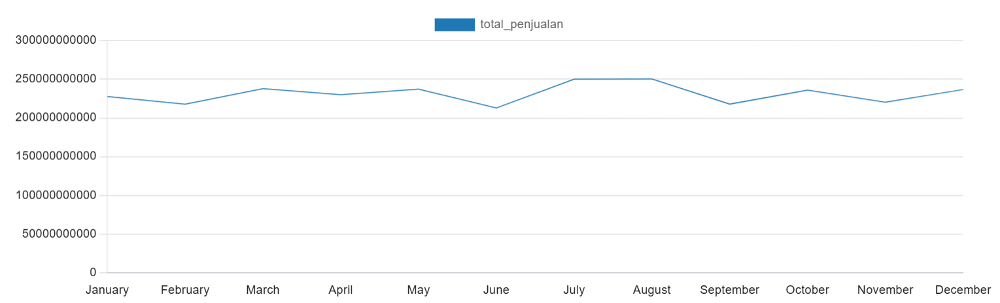
  
</p>

Penjualan bulanan menunjukkan fluktuasi, dengan kenaikan tertinggi terjadi pada bulan Juni ke Juli, yaitu dari Rp212,88 miliar menjadi Rp250,19 miliar. Kemudian mencapai level tertinggi pada Juli – Agustus dan  kembali menurun pada September. </p>

<b>Branch Performance</b></p>

> Membandingkan performa penjualan antar cabang
<p align="center">
  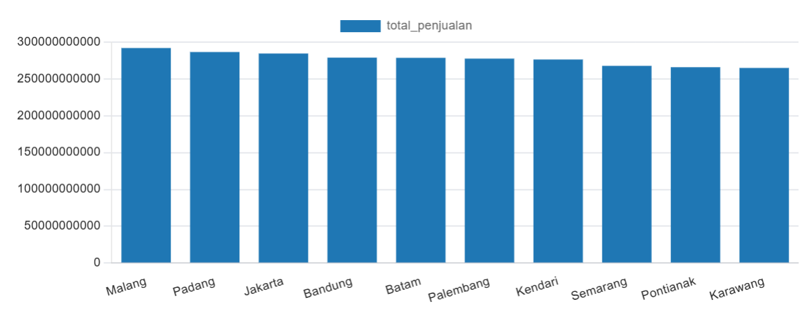
  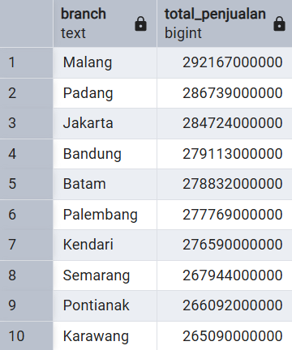
</p>

Cabang Malang menghasilkan Rp292,17 miliar atau sekitar Rp27,08 miliar lebih tinggi dibandingkan cabang dengan penjualan terendah, yaitu Karawang.</p>

<b>Sales Performance by Category</b></p>

> Mengetahui kategori kendaraan dengan kontribusi penjualan terbesar
<p align="center">
  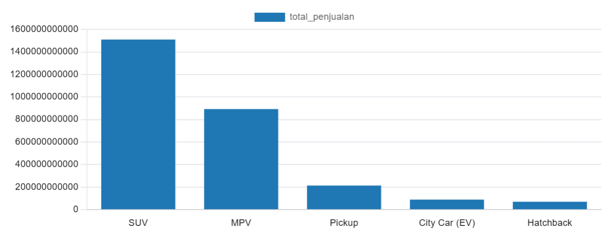
  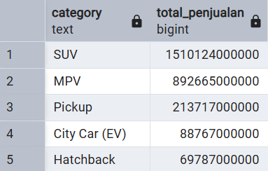
</p>

SUV mencatat penjualan tertinggi sebesar Rp1,51 triliun, jauh lebih tinggi dibandingkan kategori kendaraan lainnya.</p>

<b>Top 5 Best-Selling Products</b></p>

> Mengidentifikasi produk dengan penjualan tertinggi
<p align="center">
  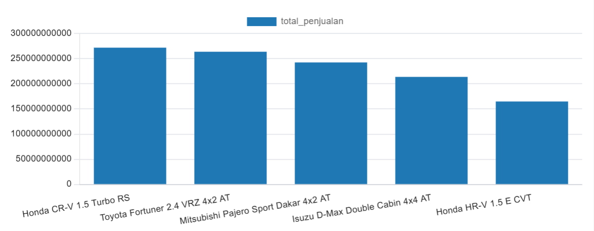
  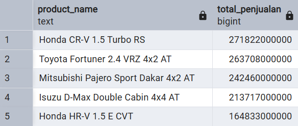
</p>

<b>Top 1 Product by Branch</b></p>

> Mengetahui produk unggulan di setiap cabang
<p align="center">
  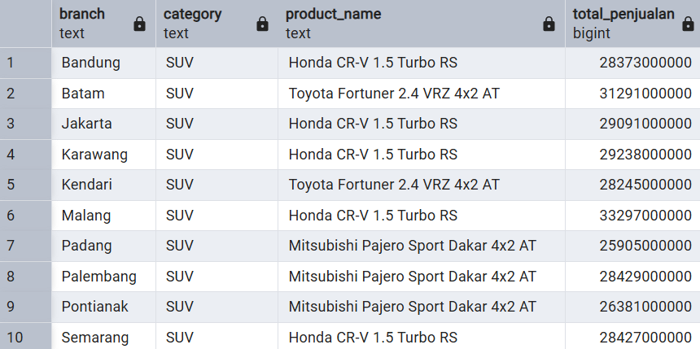
</p>

Kategori SUV mendominasi penjualan di seluruh cabang yang dianalisis. Honda CR-V 1.5 Turbo RS menjadi model yang paling sering mencatat penjualan tertinggi, diikuti Toyota Fortuner 2.4 VRZ 4x2 AT dan Mitsubishi Pajero Sport Dakar 4x2 AT.</p>


<b>Customer Transaction Frequency</b></p>

> Mengidentifikasi customer dengan frekuensi tinggi, pembelian lebih dari 4 kali transaksi
<p align="center">
  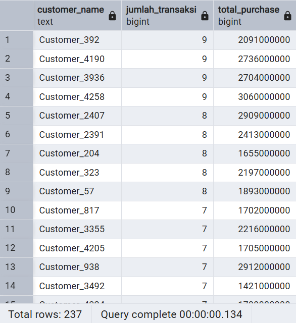

Sebanyak 237 customer tercatat melakukan pembelian kendaraan lebih dari 4 kali, dengan frekuensi pembelian tertinggi mencapai 9 kali.

<b>Transaction Status Distribution</b></p>

> Menganalisis kondisi transaksi berdasarkan status
<p align="center">
  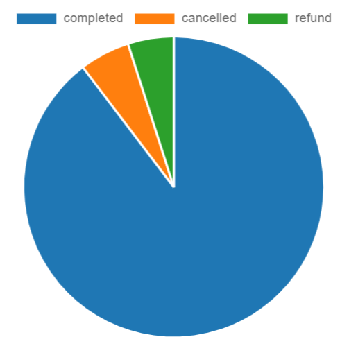
  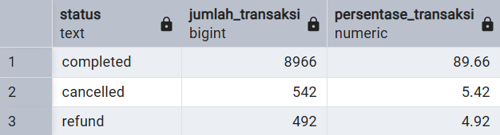
</p>
Transaksi dengan status <i>cancelled</i> dan <i>refund</i> masih mencapai 10,3% dari total transaksi, atau sebanyak 1.034 transaksi.

## Dashboard in Power BI

Performa penjualan kendaraan selama tahun 2025 divisualisasikan melalui <i>dashboard</i> interaktif menggunakan Power BI sebagai berikut.
</p>

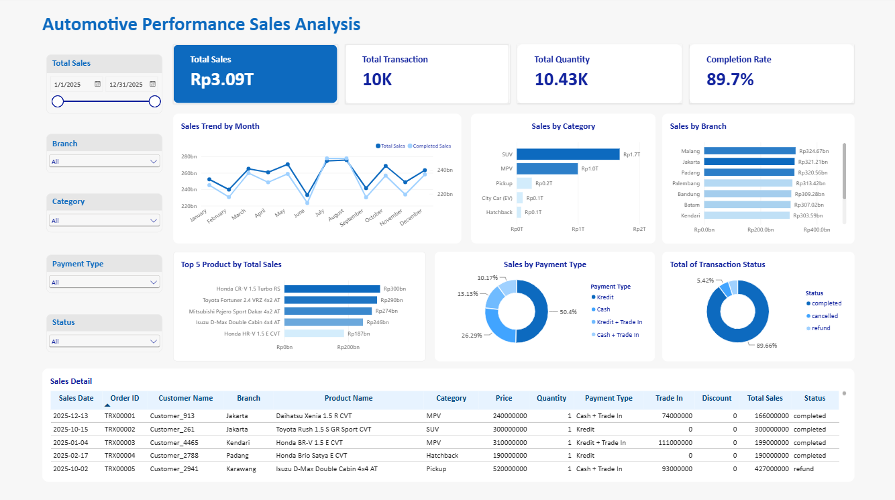

Klik [di sini](https://app.powerbi.com/view?r=eyJrIjoiNzUxMGE1YWEtMWNhYy00Y2MyLWEzNTctNmE4OTM5NWVhNDU3IiwidCI6IjA2NWRlODU2LTE3NzAtNGZiZS05N2U0LTdjZTA1MTMxYThhNSIsImMiOjEwfQ%3D%3D) untuk melihat detail <i>dashboard</i>.

## Key Insights
<b>Kategori SUV Mendominasi Penjualan</b>
<p>SUV berkontribusi  sebesar Rp1,77 triliun, atau sekitar 57% dari total sales, jauh lebih tinggi dibandingkan kategori kendaraan lainnya.</p>
<b>Metode Pembayaran Kredit Menjadi Pilihan Utama Pelanggan </b>
<p>Pembayaran secara kredit mencakup 50,4% dari total transaksi dan menjadi metode pembayaran yang paling banyak diminati dan digunakan oleh pelanggan dalam membeli kendaraan.</p>
<b>10,3% Transaksi Tidak Selesai </b>
<p>Total transaksi dengan status <i>cancellation & refund</i> mencapai 10,3% dari total transaksi.</p>

## Business Reccomendations
<b>Prioritaskan Promosi dan Ketersediaan Stok pada Kategori SUV</b>
<p>Dengan kontribusi sekitar 57% dari total sales, perusahaan dapat memprioritaskan ketersediaan unit SUV serta menyusun strategi promosi yang sesuai untuk mempertahankan dan meningkatkan kontribusi penjualan kategori tersebut.</p>
<b>Optimalkan Penawaran Pembayaran secara Kredit</b>
<p>Karena 50,4% pembayaran transaksi dilakukan secara kredit, perusahaan dapat memperkuat penawaran dengan menambah opsi tenor dan memberikan informasi cicilan yang jelas untuk mempermudah pelanggan dalam proses pembelian kendaraan. </p>
<b>Evaluasi Penyebab Cancellation & Refund</b>
<p>Transaksi yang tidak selesai/tuntas mencapai 10,3%. Sehingga perusahaan perlu mengidentifikasi dan mengevaluasi penyebabnya sebagai antisipasi untuk mengurangi potensi peningkatan transaksi <i>cancelltion & refund</i></p>

## Limitations
<b>Informasi Customer Terbatas</b>
<p>Data pelanggan hanya mencakup nama customer, belum tersedia informasi demografis seperti usia, jenis kelamin, lokasi, atau profil pelanggan. Sehingga tidak dapat dilakukan segmentasi customer secara lebih mendalam.</p>